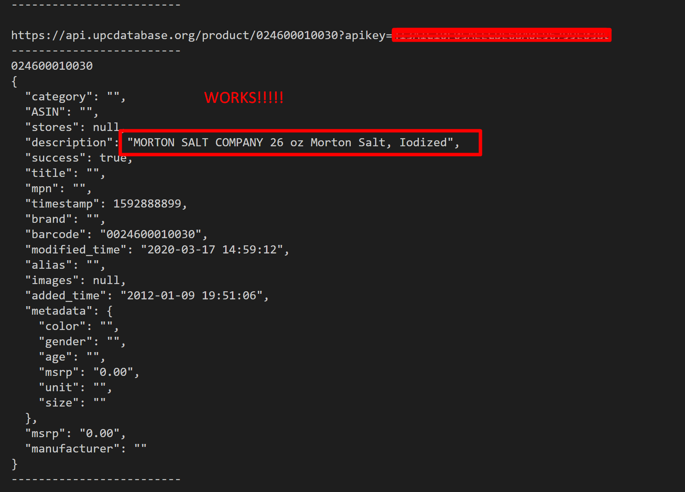

# barcode-item-tracker
 raspberry pi database that connects and tracks items entered useing a barcode scanner

```
by oran collins
github.com/wisehackermonkey
oranbusiness@gmail.com
20200622
```

# install
```
pip install -r requirements.txt
```

# install
##### plugin barcode scanner to pc
```
python3 main.py
```

# Dev log
### MVP: its alive, and works! (20200622)


### example UPC api call return
```
{
  "category": "", 
  "ASIN": "", 
  "stores": null, 
  "description": "MORTON SALT COMPANY 26 oz Morton Salt, Iodized", 
  "success": true, 
  "title": "", 
  "mpn": "", 
  "timestamp": 1592889515, 
  "brand": "", 
  "barcode": "0024600010030", 
  "modified_time": "2020-03-17 14:59:12", 
  "alias": "", 
  "images": null, 
  "added_time": "2012-01-09 19:51:06", 
  "metadata": {
    "color": "", 
    "gender": "", 
    "age": "", 
    "msrp": "0.00", 
    "unit": "", 
    "size": ""
  }, 
  "msrp": "0.00", 
  "manufacturer": ""
}
```

# what i want back 
```
description string
images string url
success bool
```

# TODO
- read barcode into app
- barcode into product name api call
- product name to image url api call
- add barcode and product name into json database
- test scanning products around the house


# Links
- https://upcdatabase.org/
- https://pypi.org/project/python-dotenv/
