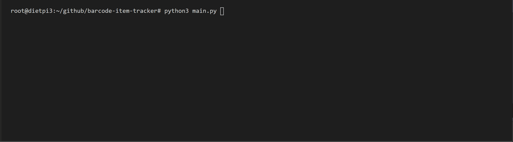
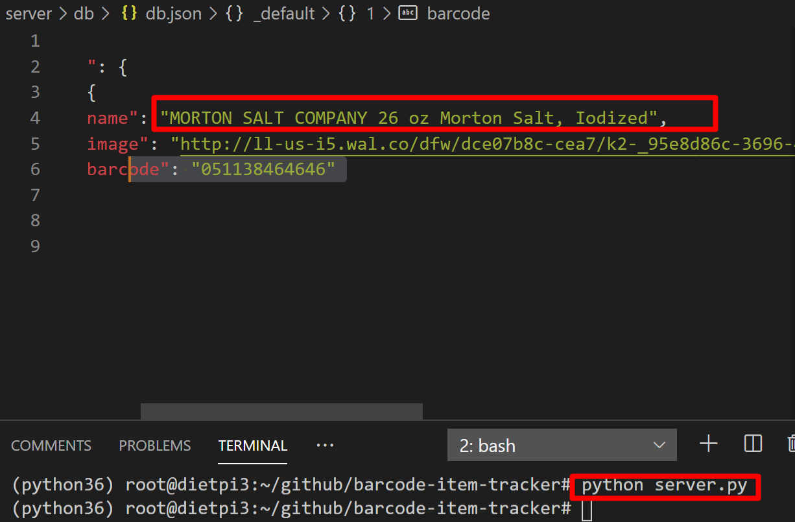
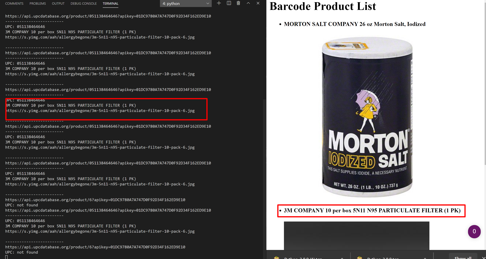
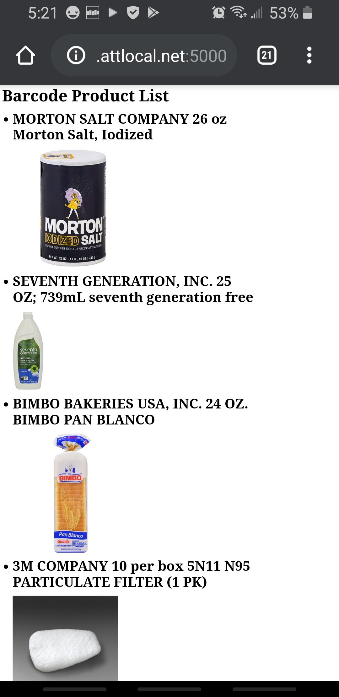

# barcode-item-tracker
 raspberry pi database that connects and tracks items entered useing a barcode scanner

```
by oran collins
github.com/wisehackermonkey
oranbusiness@gmail.com
20200622
```


# install
```
pip3 install -r requirements.txt
```

# install
##### plugin barcode scanner to pc
```
python3 main.py
```

# Run flask server
```
pip freeze | grep flask >> requirements.txt
export FLASK_APP=server.py
export FLASK_ENV=development

python -m flask run
flask run --host=0.0.0.0
``` 
# Development watch command
#### Node.js
```bash
npm install -g nodemon
nodemon --watch server/db --exec python server.py
```

##### and for barcode scanner script 'main.py'
```bash
nodemon --exec python3 main.py
```
<!-- ### or
```
pip install watchdog
watchmedo shell-command \
 --patterns="*.json" \
 --command='python "server.py"' \
 .
```  -->

# Dev log
### MVP: its alive, and works! (20200622)


### example UPC api call return
```
{
  "category": "", 
  "ASIN": "", 
  "stores": null, 
  "description": "MORTON SALT COMPANY 26 oz Morton Salt, Iodized", 
  "success": true, 
  "title": "", 
  "mpn": "", 
  "timestamp": 1592889515, 
  "brand": "", 
  "barcode": "0024600010030", 
  "modified_time": "2020-03-17 14:59:12", 
  "alias": "", 
  "images": null, 
  "added_time": "2012-01-09 19:51:06", 
  "metadata": {
    "color": "", 
    "gender": "", 
    "age": "", 
    "msrp": "0.00", 
    "unit": "", 
    "size": ""
  }, 
  "msrp": "0.00", 
  "manufacturer": ""
}
```

## what i want back 
```
description string
images string url
success bool
```
## update Got product name to image working! (20200623)


# succesfull db test 


## barcode scans pop up on web server!
### server working, and db plumed, and barcode scans pop 



## products showing up on website when scanned!
#### also switched upc providers



# TODO
##### v1
- ~~read barcode into app~~
##### v2
- ~~barcode into product name api call~~
- ~~product name to image url api call~~
- ~~use beautifuly soup to grab first image from google images~~
- ~~test scanning products around the house~~
##### v3
- ~~add barcode and product name into json database~~

- ~~add results to json database~~

- ~~webapp that renders json database to markdown or html
  - ~~create web server~~
##### v4
- fix db caching issue, on insert
- change upc code api provider

##### Future
- docker image
  - pass through usb barcode scanner (hidraw*) to docker container

# Links
- https://upcdatabase.org/
- https://pypi.org/project/python-dotenv/
- https://pypi.org/project/bleach/
- https://gist.github.com/stephenhouser/c5e2b921c3770ed47eb3b75efbc94799
- [template generator flask tutorial iternation](https://nicolas.perriault.net/code/2012/dead-easy-yet-powerful-static-website-generator-with-flask/)
- [nodemon or watchdog project reloader](https://stackoverflow.com/questions/49355010/how-do-i-watch-python-source-code-files-and-restart-when-i-save)
- [watchdog · PyPI](https://pypi.org/project/watchdog/)
- [Quickstart Flask Documentation (1.1.x)](https://flask.palletsprojects.com/en/1.1.x/quickstart/)
- [tinydb PyPI](https://pypi.org/project/tinydb/)
- [Advanced Usage TinyDB 4.1.1 documentation](https://tinydb.readthedocs.io/en/stable/usage.html#handling-data)
- [barcodelookup.com api](https://www.barcodelookup.com/api)
